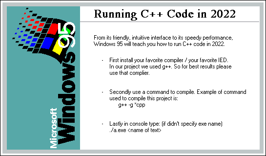

# CS 415 SP22 PROJECT 3A
## by Luke Demeter-Willison & Amit Deb

Running C++ Code in 2022
From its friendly, intuitive interface to its speedy performance,
Windows 95 will teach you how to run C++ code in 2022.

 - First install your favorite compiler / your favorite IED. 
In our project we used g++. So for best results please 
use that complier.

 - Secondly use a command to compile. Example of command 
used to compile this project is:
      g++ -g *cpp

 - Lastly in console type: (if didn't specify exe name) 
./a.exe [name of text]