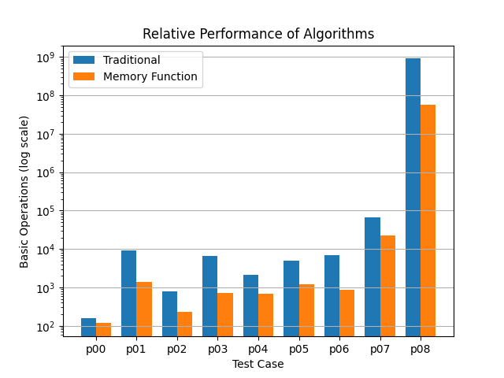
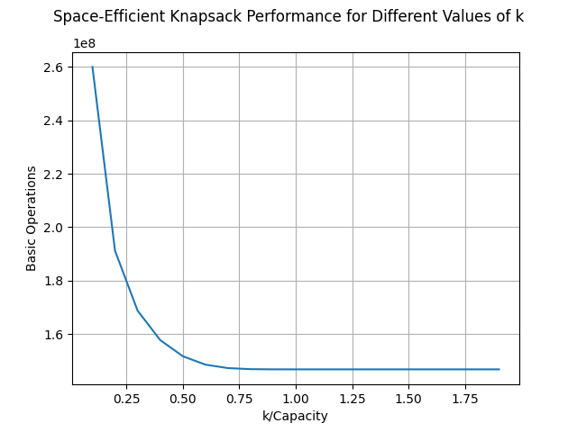
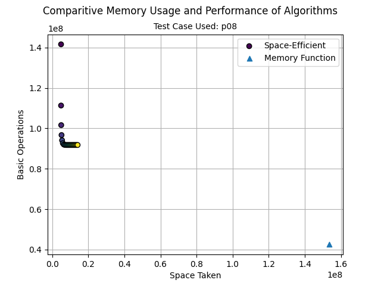

# Task 1a vs Task 1b

The memory function wins every time, and it's not hard to understand why. The memory-function algorithm only computes a value in the overall table if it's necesary, whereas the default solution iteratively goes through each option.

# Determining k

Looking at this graph, the positive returns of increasing capacity decrease exponentially until k = capacity, where the cost of the greater array outweighs it. We saw no reason to move past the point where increasing k by 1 rounded to nothing.

# Task 1b vs Task 1c

Thankfully, the relative pros and cons are easy to seperate. As one might imagine, the Space-Efficient program is more space-efficient, but does so at the cost of using a dictionary to store values, resulting in a greater overall basic operation count. The memory function stores its data uses the much simpler task of initializing a massive array, undoubtedly easier but also using up plently of unnecesary memory.