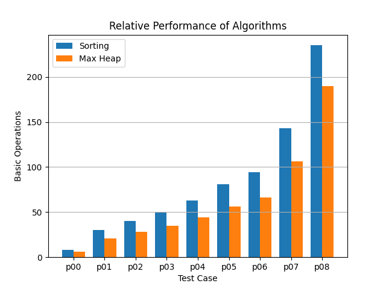

# Task 1a vs Task 1b

The memory function wins every time, and it's not hard to understand why. The memory-function algorithm only computes a value in the overall table if it's necesary, whereas the default solution iteratively goes through each option.

# Determining k

Looking at this graph, the positive returns of increasing capacity decrease exponentially until k = capacity, where the cost of the greater array is functionally nothing. We saw no reason to move past the point where increasing k by 1 rounded to nothing, which is approximately when k = capacity/2.

# Task 1b vs Task 1c

Sorting the graph takes longer as a simple consequence of the fact that sorting a list is O(n log n), where a bottom-up approach to building a heap can just be O(n).